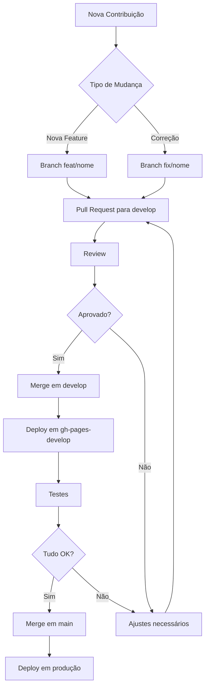

# AGENTS.md - Instruções para Agentes de IA

## 📋 Visão Geral do Projeto

Este repositório contém o site institucional da **Codaqui**, uma associação sem fins lucrativos focada em democratizar o ensino tecnológico para jovens. O site é construído com **MkDocs Material** e hospedado no GitHub Pages.

### Informações Básicas
- **Framework**: MkDocs com tema Material
- **Linguagem de Marcação**: Markdown
- **Hospedagem**: GitHub Pages
- **Repositório**: https://github.com/codaqui/institucional
- **Site**: https://codaqui.dev
- **CNPJ**: 44.593.429/0001-05

## 🎯 Objetivos do Projeto

1. **Educação Tecnológica**: Democratizar o acesso ao aprendizado de programação
2. **Comunidade**: Reunir comunidades de tecnologia sob uma estrutura organizacional
3. **Transparência**: Manter documentação aberta e acessível
4. **Inclusão**: Garantir que o conteúdo seja acessível a todos os públicos

## 📁 Estrutura do Projeto

```
institucional/
├── docs/                      # Conteúdo principal do site
│   ├── blog/                  # Blog com posts institucionais e tutoriais
│   │   ├── .authors.yml       # Autores dos posts
│   │   ├── index.md           # Página índice do blog
│   │   └── posts/             # Posts organizados por categoria
│   │       ├── curiosidade/   # Posts sobre curiosidades técnicas
│   │       ├── institucional/ # Posts sobre a organização
│   │       ├── projetos/      # Posts sobre projetos desenvolvidos
│   │       └── tutoriais/     # Tutoriais técnicos
│   ├── trilhas/               # Trilhas de aprendizado
│   │   ├── python/            # Curso de Python (16 aulas)
│   │   └── github/            # Curso de GitHub (8 aulas)
│   ├── quero/                 # Páginas de participação
│   ├── assets/                # Recursos visuais
│   └── *.md                   # Páginas principais
├── mkdocs.yml                 # Configuração principal do MkDocs
├── requirements.txt           # Dependências Python
├── README.md                  # Documentação geral
├── DEVELOPMENT.md             # Instruções de desenvolvimento
└── CNAME                      # Configuração de domínio customizado
```

## 🔧 Configuração Técnica

### Dependências Principais
```
mkdocs                                    # Gerador de site estático
mkdocs-git-authors-plugin                # Plugin de autores
mkdocs-git-committers-plugin-2           # Plugin de contribuidores
mkdocs-git-revision-date-localized-plugin # Plugin de datas
pillow                                    # Manipulação de imagens
cairosvg                                  # Renderização de SVG
```

### Plugins Ativos
- `search`: Busca no site
- `meta`: Metadados das páginas
- `tags`: Sistema de tags
- `social`: Cards sociais
- `blog`: Sistema de blog
- `git-committers`: Rastreamento de contribuidores

### Extensões Markdown
- Admonitions (blocos de aviso)
- Tabs (abas)
- Code highlighting (destaque de código)
- Emoji support
- Task lists
- Footnotes

## 📝 Padrões de Conteúdo

### Estrutura de Posts do Blog

Todo post deve conter:
```yaml
---
draft: false                # Status de publicação
date: YYYY-MM-DD           # Data de publicação
categories:                # Categorias do post
  - Categoria
tags:                      # Tags relevantes
  - tag1
  - tag2
authors:                   # Autores (definidos em .authors.yml)
  - username
# readtime: X              # Tempo de leitura estimado (opcional)
comments: true             # Habilitar comentários
---

# Título do Post

Breve descrição ou resumo do post.

<!-- more -->            # Separador de resumo

Conteúdo completo do post...
```

### Estrutura de Trilhas de Aprendizado

Cada aula deve seguir:
```markdown
# Título da Aula

## Objetivos
- Objetivo 1
- Objetivo 2

## Conteúdo Principal
[Explicações, exemplos de código, etc.]

## Exercícios Práticos
[Atividades para fixação]

## Referências
[Links e materiais complementares]
```

## 🤖 Instruções para Agentes de IA

### Ao Criar Novos Conteúdos

1. **Sempre siga os padrões estabelecidos** no mkdocs.yml e nos arquivos existentes
2. **Use frontmatter completo** em todos os arquivos Markdown
3. **Adicione alt text descritivo** em todas as imagens
4. **Use linguagem inclusiva** e acessível
5. **Revise ortografia e gramática** antes de submeter
6. **Teste links externos** para garantir que funcionam
7. **Mantenha consistência** com o estilo existente

### Ao Revisar Conteúdos

1. **Verificar ortografia** em português brasileiro
2. **Validar formatação** Markdown e YAML
3. **Testar código** em blocos de código
4. **Conferir links** internos e externos
5. **Validar estrutura** do frontmatter
6. **Verificar acessibilidade** (alt text, semântica)

### Ao Responder Questões sobre o Projeto

1. **Contexto**: A Codaqui é uma ONG educacional
2. **Público-alvo**: Jovens de 6 a 16 anos e comunidade tech
3. **Tom**: Amigável, inclusivo e educacional
4. **Valores**: Transparência, inclusão, colaboração
5. **Licença**: Creative Commons Attribution-ShareAlike

### Fluxo de Contribuição



## 📚 Recursos Importantes

### Documentação
- [MkDocs](https://www.mkdocs.org/)
- [Material for MkDocs](https://squidfunk.github.io/mkdocs-material/)
- [Markdown Guide](https://www.markdownguide.org/)

### Comunidade
- **Discord**: https://discord.com/invite/xuTtxqCPpz
- **WhatsApp**: https://chat.whatsapp.com/IvzONDeglw55ySBD71F4Up
- **GitHub Discussions**: https://github.com/codaqui/institucional/discussions

### Contatos
- **Email**: contato@codaqui.dev
- **Site**: https://codaqui.dev
- **GitHub**: https://github.com/codaqui

## 🔐 Variáveis de Ambiente

### Desenvolvimento Local
```bash
# Token do GitHub (necessário para plugins git)
export GH_TOKEN=<seu_token_aqui>

# Ativar ambiente virtual
source venv/bin/activate

# Servir localmente
mkdocs serve
```

### Deploy
- **Produção**: Branch `main` → `gh-pages`
- **Desenvolvimento**: Branch `develop` → `gh-pages-develop`
- **Preview**: https://raw.githack.com/codaqui/institucional/gh-pages-develop/index.html

## ⚠️ Cuidados Especiais

### Segurança
- Nunca commitar tokens ou credenciais
- Revisar informações pessoais antes de publicar
- Respeitar LGPD em coleta de dados

### Performance
- Otimizar imagens antes de fazer upload
- Evitar arquivos muito grandes no repositório
- Usar lazy loading para imagens quando possível

### Acessibilidade
- Sempre usar alt text em imagens
- Manter hierarquia correta de títulos (h1, h2, h3...)
- Garantir contraste adequado em cores customizadas
- Testar navegação por teclado

### SEO
- Usar descrições meta adequadas
- Manter URLs amigáveis (slugs limpos)
- Usar tags e categorias de forma consistente
- Adicionar sitemap.xml (gerado automaticamente)

## 🎨 Diretrizes de Estilo

### Tom de Voz
- **Amigável**: Usar linguagem acessível
- **Educativo**: Explicar conceitos claramente
- **Inclusivo**: Evitar jargões desnecessários
- **Profissional**: Manter seriedade em temas importantes

### Formatação de Código
```python
# Bom exemplo
def funcao_exemplo(parametro):
    """Documentação clara da função."""
    return parametro * 2

# Evitar
def f(x):return x*2  # Sem documentação ou formatação
```

### Links
- Preferir links relativos para navegação interna
- Usar títulos descritivos: `[veja nosso guia](link)` em vez de `[clique aqui](link)`
- Abrir links externos em nova aba quando apropriado

### Imagens
- Formato: PNG para capturas de tela, SVG para logos, WEBP para fotos
- Tamanho máximo: 500KB por imagem
- Resolução: Máximo 2x da exibida (para telas retina)
- Nomenclatura: `descricao-clara.extensao`

## 🧪 Testes e Validação

### Antes de Submeter PR
```bash
# 1. Validar sintaxe do mkdocs.yml
mkdocs build --strict

# 2. Testar localmente
mkdocs serve

# 3. Verificar links quebrados
# (usar ferramenta externa ou plugin)

# 4. Revisar ortografia
# (usar corretor ortográfico)

# 5. Validar frontmatter YAML
# (usar linter YAML)
```

## 📊 Métricas e Analytics

O site usa Google Analytics (G-CL043JTTND) para:
- Entender quais conteúdos são mais acessados
- Melhorar a experiência do usuário
- Medir efetividade das trilhas de aprendizado

**Sempre respeitar a LGPD e privacidade dos usuários.**

## 🤝 Comunidades Associadas

1. **DevParaná**: Comunidade de desenvolvedores do Paraná
2. **CamposTech**: Comunidade tech de Campos dos Goytacazes
3. **ElasNoCódigo**: Comunidade focada em mulheres na tecnologia

## 📱 Social Media

- GitHub: [@codaqui](https://github.com/codaqui)
- Twitter: [@codaquidev](https://twitter.com/codaquidev)
- LinkedIn: [codaqui](https://www.linkedin.com/company/codaqui)
- Instagram: [@codaqui.dev](https://instagram.com/codaqui.dev)
- YouTube: [@codaqui](https://youtube.com/@codaqui)

## 🏆 Boas Práticas

### Git Commits
```
feat: adiciona nova trilha de JavaScript
fix: corrige link quebrado na página inicial
docs: atualiza README com novas instruções
style: ajusta formatação do post sobre Python
refactor: reorganiza estrutura de pastas do blog
test: adiciona testes para links
chore: atualiza dependências do projeto
```

### Nomenclatura de Arquivos
- Posts do blog: `YYYY_MM_DD_titulo-descritivo.md`
- Imagens: `descricao-clara.extensao`
- Pastas: `nome-em-minusculo-com-hifens`

### Organização de Assets
```
docs/
└── blog/
    └── posts/
        └── categoria/
            ├── YYYY_MM_DD_post.md
            └── img/
                └── YYYY_MM_DD_post/
                    ├── imagem1.png
                    └── imagem2.png
```

## 🔄 Atualizações Frequentes

### Conteúdos que Precisam de Manutenção Regular
1. **Links externos**: Verificar mensalmente
2. **Tecnologias citadas**: Atualizar versões quando relevante
3. **Eventos**: Remover eventos passados, adicionar futuros
4. **Certificações**: Manter lista atualizada

### Revisões Anuais
1. **Código de conduta**: Revisar e atualizar se necessário
2. **Estrutura do site**: Avaliar se atende às necessidades
3. **Trilhas de aprendizado**: Atualizar conteúdos desatualizados
4. **Documentação**: Garantir que reflete o estado atual

## 💡 Dicas para Agentes

1. **Sempre verifique o contexto**: A Codaqui trabalha com jovens, então o conteúdo deve ser apropriado
2. **Use exemplos práticos**: Facilita o aprendizado
3. **Cite fontes**: Transparência é importante
4. **Seja consistente**: Siga os padrões estabelecidos
5. **Peça feedback**: Use as discussões do GitHub
6. **Teste antes de publicar**: Use o ambiente de desenvolvimento
7. **Documente mudanças**: Mantenha changelog atualizado

## 📞 Suporte

Em caso de dúvidas:
1. Consulte a documentação existente (README.md, DEVELOPMENT.md)
2. Busque em discussões anteriores no GitHub
3. Crie nova discussão se necessário
4. Entre em contato via email: contato@codaqui.dev

---

**Última atualização**: 2025-10-13

**Versão do documento**: 1.0.0

**Mantido por**: Comunidade Codaqui

**Licença**: Creative Commons Attribution-ShareAlike
