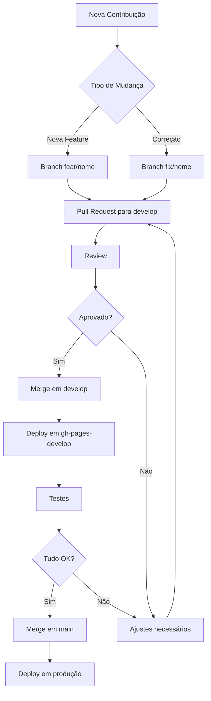

# AGENTS.md - Instruções para Agentes de IA

## 📋 Visão Geral do Projeto

Este repositório contém o site institucional da **Codaqui**, uma associação sem fins lucrativos focada em democratizar o acesso à tecnologia. O site é construído com **Docusaurus 3.9** e usa **MUI v7 (Material UI)** para componentes React ricos.

### Informações Básicas
- **Framework**: Docusaurus 3.9.2 (migrado do MkDocs Material em 2026)
- **UI Library**: MUI v7 (@mui/material, @mui/icons-material, @mui/lab)
- **Linguagem**: TypeScript + React 19 + MDX
- **Hospedagem**: GitHub Pages
- **Repositório**: https://github.com/codaqui/institucional
- **Site**: https://codaqui.dev
- **CNPJ**: 44.593.429/0001-05

## 🎯 Objetivos do Projeto

1. **Educação Tecnológica**: Democratizar o acesso ao aprendizado de programação
2. **Comunidade**: Reunir comunidades de tecnologia sob uma estrutura organizacional
3. **Transparência**: Manter documentação aberta e acessível
4. **Inclusão**: Garantir que o conteúdo seja acessível a todos os públicos

## 📁 Estrutura do Projeto

```
institucional/
├── blog/                      # Posts do blog (formato Docusaurus)
│   ├── authors.yml            # Autores dos posts
│   └── YYYY-MM-DD-slug.md    # Posts com slug: YYYY/MM/DD/slug (preserva URLs antigas)
├── trilhas/                   # Trilhas de aprendizado (plugin docs)
│   ├── python/                # Curso de Python (16 aulas: page-1 a page-16)
│   └── github/                # Curso de GitHub (8 aulas: page-1 a page-8)
├── src/
│   ├── components/            # Componentes reutilizáveis
│   │   ├── Badge/
│   │   ├── GiscusComponent/   # Comentários via Giscus
│   │   ├── LessonCard/
│   │   └── VideoEmbed/
│   ├── data/                  # ⭐ Dados centralizados (NUNCA duplicar nas páginas)
│   │   ├── social.ts          # DISCORD_URL, WHATSAPP_URL, EMAIL, socialChannels[]
│   │   ├── team.ts            # diretoria[], membros[], alumni[], mentores[]
│   │   ├── communities.ts     # communities[] (5 comunidades parceiras)
│   │   ├── projects.ts        # projects[] (9 projetos open source)
│   │   └── timeline.ts        # timelineEvents[] (2020-2026)
│   ├── pages/                 # Páginas do site
│   │   ├── index.tsx          # Homepage com MUI
│   │   ├── bio.tsx            # Página de links (ex-bio.md)
│   │   ├── contato.tsx        # Contato com MUI Cards
│   │   ├── projetos.tsx       # Projetos com MUI Cards
│   │   ├── blog/archive/      # Redirects para /blog/archive#YEAR
│   │   ├── participe/
│   │   │   ├── estudar.md
│   │   │   ├── mentoria.md
│   │   │   └── apoiar.md
│   │   ├── sobre/
│   │   │   ├── equipe.tsx     # Equipe com MUI Avatar+Card+Chip
│   │   │   ├── ong.tsx        # Comunidades com MUI Cards
│   │   │   ├── timeline.tsx   # Timeline com @mui/lab Timeline
│   │   │   ├── conduta.md
│   │   │   └── pais-responsaveis.md
│   │   └── quero/             # Redirects de compatibilidade URL
│   └── theme/
│       ├── muiTheme.ts        # Tema MUI (cor primária #22c55e)
│       ├── Root.tsx           # ThemeProvider + dark/light sync
│       └── BlogPostItem/      # Swizzle para injetar Giscus
├── static/                    # Assets estáticos
│   ├── img/                   # Logos e imagens
│   └── assets/docs/           # PDFs (estatuto.pdf)
├── docusaurus.config.ts       # Configuração principal
├── sidebars.ts                # Sidebar das trilhas
└── CNAME                      # codaqui.dev
```

## 🔧 Configuração Técnica

### Comandos
```bash
npm start          # Servidor de desenvolvimento (localhost:3000)
npm run build      # Build de produção (pasta build/)
npm run serve      # Servir o build local (requer build primeiro)
```

### Dependências Principais
```json
"@docusaurus/core": "^3.9.2"
"@docusaurus/preset-classic": "^3.9.2"
"@docusaurus/theme-live-codeblock": "^3.9.2"
"@docusaurus/theme-mermaid": "^3.9.2"
"@mui/material": "^7.x"
"@mui/icons-material": "^7.x"
"@mui/lab": "^7.x"
"@emotion/react": "^11.x"
"@emotion/styled": "^11.x"
"@giscus/react": "^3.x"
"react": "^19.0.0"
```

### Temas Docusaurus Ativos
- `@docusaurus/theme-live-codeblock` — blocos de código interativos
- `@docusaurus/theme-mermaid` — diagramas Mermaid

### Plugins Docusaurus Ativos
- `blog` (preset) — com `tagsBasePath: 'category'` (mantém URLs `/blog/category/X/`)
- `docs` para trilhas — `path: 'trilhas'`, `routeBasePath: 'trilhas'`
- `@docusaurus/plugin-google-gtag` — Analytics G-CL043JTTND
- `@docusaurus/plugin-pwa` — Progressive Web App

## 📝 Padrões de Conteúdo

### Estrutura de Posts do Blog

Arquivo em `blog/YYYY-MM-DD-slug.md`. O `slug:` deve ser `YYYY/MM/DD/nome` para preservar as URLs do Google:

```yaml
---
slug: 2024/07/22/meu-post
title: Título do Post
authors: [username]
tags: [tag1, tag2]
date: 2024-07-22
---

Resumo do post (mostrado no listing).

<!-- truncate -->

Conteúdo completo...
```

### Estrutura de Trilhas de Aprendizado

Arquivos em `trilhas/python/page-N.md` ou `trilhas/github/page-N.md`:

```markdown
---
sidebar_position: N
title: Título da Aula
---

# Título da Aula

## Objetivos
## Conteúdo Principal
## Exercícios Práticos
## Referências
```

### Adicionando Membros ao Time

**Nunca edite diretamente `equipe.tsx`**. Edite `src/data/team.ts`:

```typescript
// Adicionar ao array correto (diretoria, membros, alumni ou mentores)
{ 
  name: "Nome Completo",
  role: "Cargo",
  avatar: "https://avatars.githubusercontent.com/username?v=4",
  linkedin: "https://www.linkedin.com/in/username/",  // opcional
  github: "https://github.com/username",              // opcional
  specialty: "Área de especialidade",                 // só para mentores
}
```

### Adicionando Comunidades Parceiras

Edite `src/data/communities.ts` — não edite `ong.tsx` nem `index.tsx` diretamente.

### Links Sociais Centralizados

Todos os links de Discord/WhatsApp/Email estão em `src/data/social.ts`:
- `DISCORD_URL` — `https://discord.com/invite/xuTtxqCPpz`
- `WHATSAPP_URL` — `https://chat.whatsapp.com/IvzONDeglw55ySBD71F4Up`
- `EMAIL` — `contato@codaqui.dev`

**Importe sempre de `src/data/social.ts`** — nunca cole o link hardcoded numa página.

## 🤖 Instruções para Agentes de IA

### Ao Criar Novos Conteúdos

1. **Blog posts**: Use o formato Docusaurus com `slug: YYYY/MM/DD/nome` — crítico para SEO
2. **Dados de equipe/comunidade/projetos**: Edite `src/data/*.ts`, nunca inline nos componentes
3. **Componentes novos**: Crie em `src/components/NomeDoComponente/index.tsx`
4. **Páginas ricas (TSX)**: Use MUI v7 — `Grid2` (não `Grid`), `Card`, `Avatar`, `Chip`, `Typography`, `Box`
5. **Use linguagem inclusiva**: "participantes" (não "alunos"), "encontros" (não "aulas"), "programa" (não "curso")
6. **Tom**: Amigável, inclusivo, educacional — público diverso, sem restrição de idade

### Ao Usar MUI v7

```tsx
// ✅ CORRETO — Grid2 (não Grid)
import { Grid2, Card, CardContent, Avatar, Chip, Typography, Box } from '@mui/material';
import { LinkedIn, GitHub } from '@mui/icons-material';
import { Timeline, TimelineItem } from '@mui/lab';

// ✅ CORRETO — sx prop (não makeStyles, não styled-components)
<Card sx={{ '&:hover': { transform: 'translateY(-4px)', boxShadow: 6 } }}>

// ✅ CORRETO — Grid2 responsivo
<Grid2 container spacing={3}>
  <Grid2 size={{ xs: 12, sm: 6, md: 4 }}>
```

### Ao Responder Questões sobre o Projeto

1. **Contexto**: A Codaqui é uma associação sem fins lucrativos — guarda-chuva de comunidades tech
2. **Branding**: "Associação Codaqui" (não "escola"), "participantes" (não "alunos")
3. **Valores**: Transparência, inclusão, colaboração, crescimento coletivo
4. **Licença**: Creative Commons Attribution-ShareAlike

### Fluxo de Contribuição


```mermaid
graph TD
    A[Nova Contribuição] --> B{Tipo de Mudança}
    B -->|Nova Feature| C[Branch feat/nome]
    B -->|Correção| D[Branch fix/nome]
    C --> E[Pull Request para develop]
    D --> E
    E --> F[Review]
    F --> G{Aprovado?}
    G -->|Sim| H[Merge em develop]
    G -->|Não| I[Ajustes necessários]
    I --> E
    H --> J[Deploy em gh-pages-develop]
    J --> K[Testes]
    K --> L{Tudo OK?}
    L -->|Sim| M[Merge em main]
    L -->|Não| I
    M --> N[Deploy em produção]
```

## 📚 Recursos Importantes

### Documentação
- [Docusaurus 3.9](https://docusaurus.io/docs)
- [MUI v7](https://mui.com/material-ui/all-components/)
- [MUI Timeline (@mui/lab)](https://mui.com/material-ui/react-timeline/)
- [Markdown Guide](https://www.markdownguide.org/)

### Comunidade
- **Discord**: https://discord.com/invite/xuTtxqCPpz
- **WhatsApp**: https://chat.whatsapp.com/IvzONDeglw55ySBD71F4Up
- **GitHub Discussions**: https://github.com/codaqui/institucional/discussions

### Contatos
- **Email**: contato@codaqui.dev
- **Site**: https://codaqui.dev
- **GitHub**: https://github.com/codaqui

## 🔐 Variáveis de Ambiente

### Desenvolvimento Local
```bash
npm install        # Instalar dependências
npm start          # http://localhost:3000
npm run build      # Build de produção
npm run serve      # Servir build local
```

### Deploy
- **Produção**: Branch `main` → `gh-pages` (via GitHub Actions)
- **Desenvolvimento**: Branch `develop` → `gh-pages-develop` (via GitHub Actions)

## ⚠️ Cuidados Especiais

### SEO — CRÍTICO
- Slugs de blog DEVEM usar `slug: YYYY/MM/DD/nome` para manter URLs indexadas pelo Google
- `tagsBasePath: 'category'` preserva `/blog/category/X/` — não alterar
- Redirects em `src/pages/quero/*.tsx` e `src/pages/team.tsx` etc. — não remover

### Segurança
- Nunca commitar tokens ou credenciais
- Revisar informações pessoais antes de publicar
- Respeitar LGPD em coleta de dados

### Performance
- Otimizar imagens antes de fazer upload (max 500KB)
- Logos de comunidades: SVG preferido, PNG < 100KB
- MUI carrega sob demanda — não importar `@mui/material` inteiro, importar por componente

### Acessibilidade
- MUI Avatar: sempre informar `alt={name}`
- Manter hierarquia correta de títulos (h1 → h2 → h3)
- Usar `aria-label` em IconButtons (e.g., `aria-label="LinkedIn de {name}"`)

## 🎨 Diretrizes de Estilo

### Tom de Voz
- **Amigável**: Linguagem acessível, sem jargão
- **Inclusivo**: "participantes" (não "alunos"), "programa" (não "curso"), "encontros" (não "aulas")
- **Institucional**: A Codaqui é uma "Associação" — não "escola" ou "empresa"

### Links
- Links internos: relativos (e.g., `href="/sobre/equipe"`)
- Links externos: sempre `target="_blank" rel="noopener noreferrer"`
- Nunca usar "clique aqui" — use texto descritivo

### Imagens
- Formato: SVG para logos, PNG para screenshots, WEBP para fotos
- Tamanho máximo: 500KB por imagem
- Nomenclatura: `descricao-clara.extensao`

## 🧪 Testes e Validação

### Antes de Submeter PR
```bash
# 1. Build sem erros
npm run build

# 2. Testar localmente
npm start

# 3. Verificar TypeScript
npx tsc --noEmit
```

## 📊 Métricas e Analytics

O site usa Google Analytics (G-CL043JTTND) para:
- Entender quais conteúdos são mais acessados
- Melhorar a experiência do usuário
- Medir efetividade das trilhas de aprendizado

**Sempre respeitar a LGPD e privacidade dos usuários.**

## 🤝 Comunidades Associadas

1. **DevParaná**: Comunidade de desenvolvedores do Paraná
2. **CamposTech**: Comunidade tech de Campos dos Goytacazes
3. **ElasNoCódigo**: Comunidade focada em mulheres na tecnologia

## 📱 Social Media

- GitHub: [@codaqui](https://github.com/codaqui)
- Twitter: [@codaquidev](https://twitter.com/codaquidev)
- LinkedIn: [codaqui](https://www.linkedin.com/company/codaqui)
- Instagram: [@codaqui.dev](https://instagram.com/codaqui.dev)
- YouTube: [@codaqui](https://youtube.com/@codaqui)

## 🏆 Boas Práticas

### Git Commits
```
feat: adiciona nova trilha de JavaScript
fix: corrige link quebrado na página inicial
docs: atualiza README com novas instruções
style: ajusta formatação do post sobre Python
refactor: reorganiza estrutura de pastas do blog
test: adiciona testes para links
chore: atualiza dependências do projeto
```

### Nomenclatura de Arquivos
- Posts do blog: `YYYY-MM-DD-titulo-descritivo.md` (com frontmatter `slug: YYYY/MM/DD/titulo`)
- Imagens do blog: `blog/img/YYYY-MM-DD-slug/imagem.png`
- Componentes: `src/components/NomeComponente/index.tsx`
- Dados: `src/data/nome-do-dado.ts`
- Pastas: `nome-em-minusculo-com-hifens`

## 🔄 Atualizações Frequentes

### Conteúdos que Precisam de Manutenção Regular
1. **`src/data/team.ts`**: Adicionar/remover membros, diretoria, mentores
2. **`src/data/communities.ts`**: Adicionar novas comunidades parceiras
3. **`src/data/timeline.ts`**: Adicionar eventos anuais
4. **Links externos**: Verificar periodicamente
5. **`src/data/social.ts`**: Atualizar se o link do WhatsApp mudar

## 💡 Dicas para Agentes

1. **Dados centralizados**: Sempre editar `src/data/*.ts` — nunca inline nos componentes
2. **MUI v7**: Usar `Grid` (não `Grid2`) com `size={{ xs, sm, md }}`
3. **Dark mode**: O ThemeProvider em `src/theme/Root.tsx` sincroniza MUI com Docusaurus automaticamente
4. **URLs legadas**: Não remover arquivos em `src/pages/quero/` — são redirects do Google
5. **Linguagem inclusiva**: "participantes", "programa", "encontros", "Associação"
6. **Testar antes de publicar**: `npm run build` deve passar sem erros

## 📞 Suporte

Em caso de dúvidas:
1. Consulte a documentação existente (README.md, DEVELOPMENT.md, AGENTS.md)
2. Busque em discussões anteriores no GitHub
3. Crie nova discussão se necessário
4. Entre em contato via email: contato@codaqui.dev

---

**Última atualização**: 2026-03-31

**Versão do documento**: 2.0.0

**Mantido por**: Comunidade Codaqui

**Licença**: Creative Commons Attribution-ShareAlike
