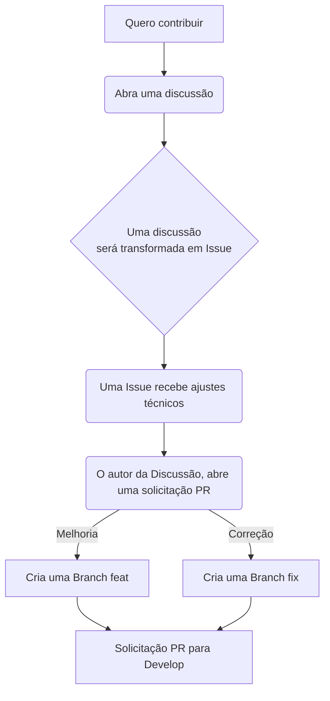

# CODAQUI


## Bem vindo 🫶

Se você deseja acessar o nosso site basta [clicar aqui](https://codaqui.dev), se você deseja ver o preview gerado pela branch `develop` [acesse aqui](https://codaqui.dev/previews/develop/).

Os previews publicados usam a mesma estratégia:
- `develop` → `https://codaqui.dev/previews/develop/`
- PRs → `https://codaqui.dev/previews/pr-<numero>/`

Em produção, o `robots.txt` permite indexação normal e expõe o sitemap. Nos previews, o build aplica `noindex` e sobrescreve o `robots.txt` para bloquear crawling.

O deploy principal também pode ser reexecutado manualmente no GitHub Actions quando for preciso republicar `main` ou `develop` sem criar um novo commit.

## Tecnologia

Este site é construído com [Docusaurus 3.9](https://docusaurus.io/), um gerador de sites estáticos moderno baseado em React.

### Pré-requisitos

- [Node.js](https://nodejs.org/) versão 24 ou superior
- npm (incluído com o Node.js)

### Desenvolvimento Local

```bash
# Instalar dependências
npm install

# Iniciar servidor de desenvolvimento
npm start
```

O servidor de desenvolvimento estará disponível em `http://localhost:3000`.

### Build

```bash
# Gerar build de produção
npm run build

# Servir build localmente
npm run serve
```

Para simular um preview de PR localmente, gere o build com subpath:

```bash
BASE_URL=/previews/pr-123/ PREVIEW=true PREVIEW_PR_NUMBER=123 npm run build
```

Os previews automáticos de PR são publicados em `https://codaqui.dev/previews/pr-<numero>/`, comentados no PR e removidos ao fechar ou fazer merge. Em PRs vindos de forks, o build continua sendo gerado, mas a publicação é pulada por segurança.

Quando o PR é `develop -> main`, reutilizamos `https://codaqui.dev/previews/develop/` em vez de gerar um preview dedicado.

### Snapshots de eventos

A página `/eventos` consome snapshots estáticos versionados em:

```bash
/events/index.json
/events/<source>/<source_id>/index.json
/events/<source>/<source_id>/<event_id>.json
```

O fluxo ideal é:

- um workflow consulta a API da fonte com alguma frequência
- normaliza os dados para o contrato público de eventos
- publica um índice agregado leve para a UI
- publica shards por fonte e um arquivo por evento para detalhe/cache

Hoje o repositório já inclui o script `scripts/sync-events.mjs` e o workflow `sync-event-snapshots.yml` como base para esse processo.

## Contribuições

Você quer ajudar a Codaqui? Você pode iniciar uma nova [Discussão](https://github.com/codaqui/institucional/discussions), ou uma Issue referente a algo pontual [por aqui](https://github.com/codaqui/institucional/issues/new/choose). Você também pode visualizar as Issues/Discussões já existentes e interagir com a comunidade.  

Leia nosso documento completo sobre como apoiar a comunidade [clicando aqui.](https://www.codaqui.dev/participe/apoiar) 😁

## Espaços de Discussão

Espaço de centralização das discussões e documentações: [Site](https://codaqui.dev) e [Discussões no GitHub](https://github.com/codaqui/institucional/discussions)

Espaço destinado a alunos: [Discord](https://discord.gg/xuTtxqCPpz) - [Manual do Aluno](https://www.codaqui.dev/participe/estudar)

Espaço destinado a voluntários: [Manual do Voluntário](https://www.codaqui.dev/participe/apoiar)

Comunidade no Whatsapp: [Acesse aqui!](https://chat.whatsapp.com/IvzONDeglw55ySBD71F4Up)

## Desenvolvimento

O desenvolvimento do site é mantido por voluntários e alunos, assim como todos os materiais, se você quiser colaborar com o desenvolvimento, leia o documento do desenvolvimento [clicando aqui.](DEVELOPMENT.md) =] 



## Estrutura do Projeto

```
institucional/
├── blog/                  # Posts do blog
│   ├── authors.yml        # Configuração de autores
│   └── *.md               # Posts do blog
├── trilhas/               # Trilhas de aprendizado (Docusaurus docs)
│   ├── python/            # Curso de Python (16 aulas)
│   └── github/            # Curso de GitHub (8 aulas)
├── src/
│   ├── pages/             # Páginas do site
│   │   ├── sobre/         # Páginas "Sobre"
│   │   └── participe/     # Páginas "Participe"
│   ├── css/               # Estilos customizados
│   └── components/        # Componentes React
├── static/                # Arquivos estáticos (imagens, etc.)
├── docusaurus.config.ts   # Configuração principal
├── sidebars.ts            # Configuração das sidebars
└── package.json           # Dependências Node.js
```
