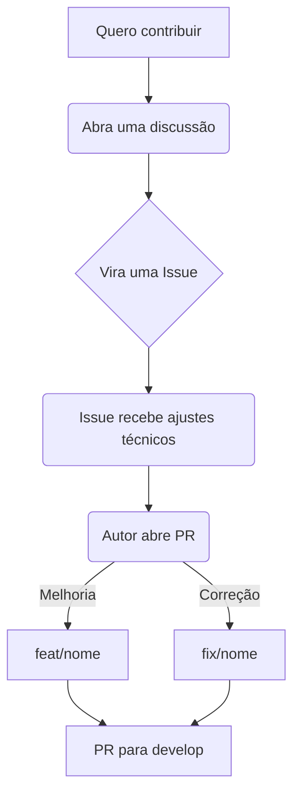

<!-- AGENT-INDEX
purpose: High-level overview of the codaqui/institucional monorepo.
audience: New contributors, casual readers, AI agents
sections:
  - Sobre o Repositório (monorepo: frontend + backend)
  - Como Contribuir (links to DEVELOPMENT.md sections)
  - Espaços de Discussão (Discord, WhatsApp, GitHub)
  - Previews de Branch (gh-pages preview URLs)
  - Fluxo de Contribuição (mermaid)
related-docs:
  - AGENTS.md — main guide for AI agents (rules, patterns, anti-patterns)
  - DEVELOPMENT.md — setup, env, deploy
  - backend/README.md — backend-specific
agent-protocol: README is intentionally short. For implementation details, go to AGENTS.md or DEVELOPMENT.md.
-->

# CODAQUI

Codaqui é uma **associação brasileira sem fins lucrativos** que democratiza educação em tecnologia para jovens, servindo como guarda-chuva para comunidades parceiras de tech.

**Site**: https://codaqui.dev · **CNPJ**: 44.593.429/0001-05

---

## Sobre o Repositório

Este repositório é um **monorepo**:

| Camada | Diretório | Hospedagem |
|--------|-----------|-----------|
| Frontend (Docusaurus) | `/` (raiz) | GitHub Pages — automático via CI |
| Backend (NestJS) | [`backend/`](./backend/README.md) | Servidor ARM64 via Podman Compose |

O GitHub Pages **nunca** publica o `backend/`. O CI usa apenas `npm ci → npm run build → deploy`.

---

## Como Contribuir

Para detalhes de setup, comandos e fluxo de desenvolvimento, consulte o **[DEVELOPMENT.md](./DEVELOPMENT.md)**:

- [Contribuindo só no Frontend](./DEVELOPMENT.md#frontend-docusaurus) — sem Podman, sem backend
- [Desenvolvendo o Backend](./DEVELOPMENT.md#backend-nestjs)
- [Ambiente Full Stack](./DEVELOPMENT.md#full-stack-frontend--backend--infra)
- [Deploy](./DEVELOPMENT.md#deploy)

---

## Espaços de Discussão

- Discussões e docs: [codaqui.dev](https://codaqui.dev) · [GitHub Discussions](https://github.com/codaqui/institucional/discussions)
- Participantes: [Discord](https://discord.gg/xuTtxqCPpz) · [Manual do Participante](https://www.codaqui.dev/participe/estudar)
- Voluntários: [Manual do Voluntário](https://www.codaqui.dev/participe/apoiar)
- WhatsApp: [Acesse aqui](https://chat.whatsapp.com/IvzONDeglw55ySBD71F4Up)

---

## Previews de Branch

| Branch | URL |
|--------|-----|
| `main` | https://codaqui.dev (produção) |
| `develop` | https://codaqui.dev/previews/develop/ |
| PRs | https://codaqui.dev/previews/pr-`<numero>`/ |

Os previews usam `noIndex: true` — não aparecem em buscas.

---

## Fluxo de Contribuição

