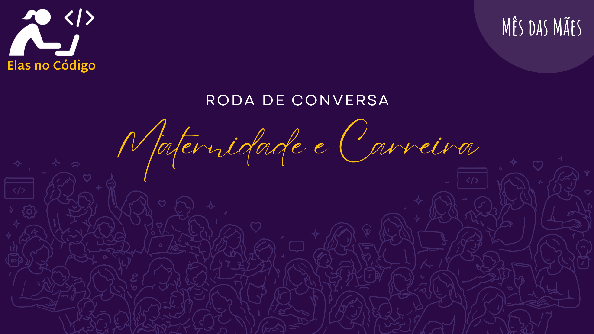

# Maternidade e Carreira: Ocupando Espaços e Transformando a Tecnologia! 🚀💜

Neste mês de maio de 2026, em celebração ao **Mês das Mães**, a **Elas No Código** promove uma roda de conversa acolhedora e necessária.

Sabemos que equilibrar o "build" da carreira com a rotina da maternidade exige força, estratégia e, acima de tudo, rede de apoio. Vamos reunir especialistas que são referência no mercado para debater como a maternidade e a tecnologia podem ser potências que se somam.

<!-- truncate -->

## Sobre a Roda de Conversa

O evento será uma transmissão ao vivo, focada em compartilhar realidades e superações sem romantização. Um espaço para discutirmos como estamos construindo o futuro da tecnologia juntas, equilibrando o amor e as linhas de código.

### 📅 Cronograma

* **Abertura e Conexão:** Boas-vindas e apresentação do Movimento Elas No Código.
* **Bloco 1:** Antes e Depois da Maternidade (Impactos na produtividade, concentração e liderança).
* **Bloco 2:** A Realidade Sem Filtro (Desafios de conciliação, licença-maternidade e o retorno ao mercado).
* **Bloco 3:** Rede de Apoio e Futuro (O papel das empresas e o legado para as próximas gerações).
* **Encerramento:** Bate-pronto final com conselhos práticos.

## Sobre as Convidadas

### Raquel Silva

Matemática formada pelo IME-USP, com aperfeiçoamento em Mineração de Dados Complexos pela Unicamp. Atua há 10 anos com análise de dados, *machine learning* e modelagem estatística. É uma entusiasta das descobertas e avanços da ciência.

### Poliane Pio de Oliveira

Profissional de TI com 9 anos de experiência, graduada em Sistemas de Informação e pós-graduada em Segurança da Informação pela PUC Minas. Atualmente atua na área de Segurança da Informação com foco em Gestão de Acessos.

### Carim Tho

Formada em Engenharia Física pela UFSCar, possui 8 anos de experiência em desenvolvimento Java. Atualmente exerce o papel de Arquiteta de Software na Ambev.

## Hosts da Roda

* **Maria Luiza Pontes:** Engenheira de Software Sênior na Stone, com 13 anos de experiência na área de desenvolvimento.
* **Karoline Farias:** Analista de Machine Learning e Cientista de Dados.

## Tópicos que serão abordados

Durante a live, vamos mergulhar nos seguintes temas:

* **Produtividade e Foco:** Como a maternidade redefine a forma de encarar o raciocínio constante e a profundidade técnica.
* **Carga Mental:** O equilíbrio entre a alta responsabilidade da tecnologia (como Segurança e Arquitetura) e o cuidado com os filhos.
* **Mercado de Trabalho:** A percepção do mercado sobre mulheres mães e a necessidade de provar competência.
* **Retorno da Licença:** O enfrentamento da culpa, do medo de ficar "para trás" e a importância do acolhimento das equipes.
* **Cultura Corporativa:** O que as empresas podem fazer na prática para humanizar o ambiente para as mães.

## Como Participar?

Acompanhe a transmissão ao vivo no dia **16/05 (Sábado) às 14:00**:

* 🎥 **[YouTube](https://www.youtube.com/watch?v=YZj46bOuCJM)** 
* 🎟️ **[Inscrição (Sympla)](https://www.sympla.com.br/evento-online/roda-de-conversa-maternidade-e-carreira/3421888)**

## Mais Informações

O **Elas No Código** é uma comunidade que acredita que o lugar de mãe é onde ela quiser — inclusive dominando o código. Nossa missão é fortalecer o protagonismo feminino através de uma rede de apoio que discute carreira e vida real.

* 📱 **Instagram:** [@elasnocodigo](https://instagram.com/elasnocodigo) 

---

## Reflexão

Antes de participar, pense:

* Qual habilidade a maternidade fortaleceu em você que a tornou uma profissional melhor? 
* O que você diria hoje para a sua versão que estava prestes a voltar da licença-maternidade? 
* Que exemplo você espera deixar para seus filhos ao continuar construindo sua carreira tech? 

---

*Maternidade e carreira na tecnologia não deveriam ser caminhos opostos, mas sim potências que se somam.*
