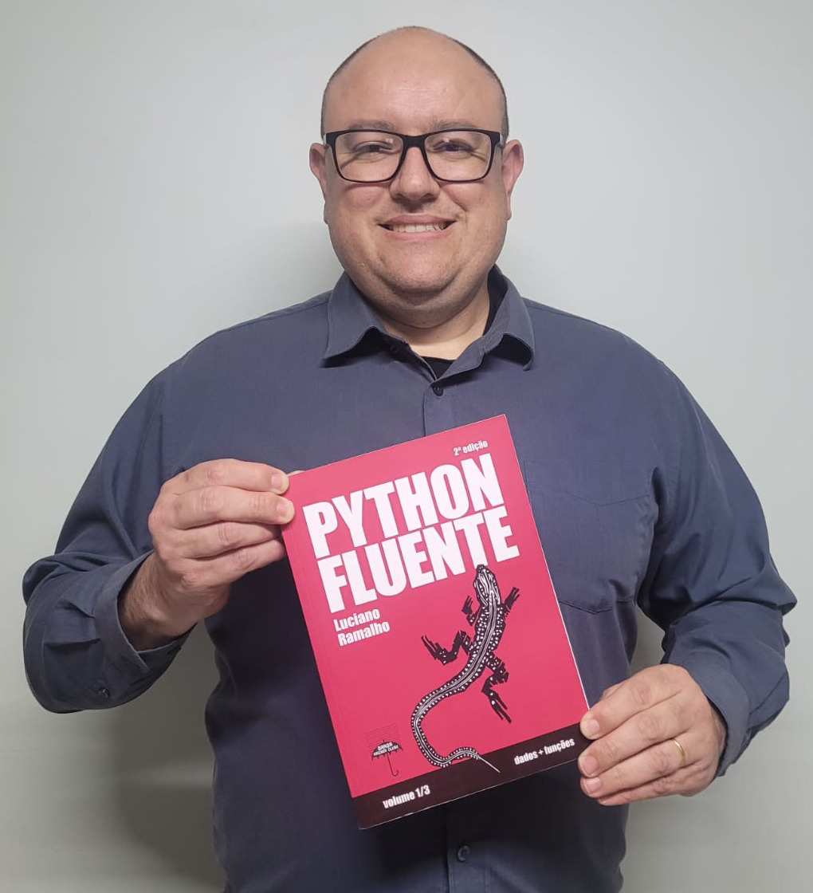

O primeiro sorteio do **Clube Codaqui** tem um ganhador! 🏆 E, para celebrar, já liberamos **dois novos sorteios** exclusivos para membros do clube: um **ingresso da DevPR Conf 2026** e o livro **Python Fluente — Volume 2**.

<!-- truncate -->

## 🏆 Parabéns, Augusto Viana!

O **[Augusto Viana](https://www.linkedin.com/in/augustoviante/)** foi o grande ganhador do primeiro sorteio do Clube Codaqui e já recebeu o prêmio com a gente: o livro **Python Fluente**, do Luciano Ramalho.

Augusto, muito obrigado por fazer parte da nossa comunidade e por apoiar a Associação Codaqui! Que o livro renda muitos códigos fluentes. 🐍

## 🎫🎫 Dois novos sorteios no ar!

Chegou a vez de novos membros do clube concorrerem! Foram liberados **dois sorteios**, cada um com o seu prêmio:

- 🎟️ **Sorteio 1 — Ingresso DevPR Conf 2026:** 1 ingresso para a conferência da comunidade DevParaná;
- 📚 **Sorteio 2 — Python Fluente Vol. 2:** 1 livro para mergulhar ainda mais fundo em Python.

A participação é exclusiva para **membros do Clube Codaqui**: basta trocar seus **SortCoins** por cupons do sorteio que quiser na página do clube — você pode participar de um ou de os dois! Cada SortCoin é conquistado participando da comunidade — em encontros, trilhas e contribuições à Associação.

Todos os sorteios do clube usam um **seed auditável**, com transparência total sobre o resultado — confiança é um dos nossos valores.

👉 **[Acesse codaqui.dev/clube](https://codaqui.dev/clube)**, veja o custo em SortCoins de cada cupom e garanta a sua participação. Boa sorte! 🍀
