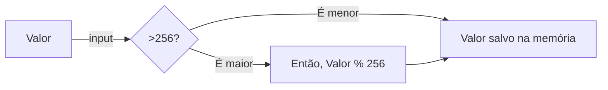

# Oque é endereçamento de memória?

Em resumo ele se refere ao processo de atribuir identificadores únicos, chamados de endereços, a locais específicos na memória de um computador. Esses endereços são utilizados para acessar e manipular dados armazenados na memória.

<!-- more -->

- O limite do endereçamento de memória em uma linguagem de programação depende da arquitetura do computador e do sistema operacional em que o programa está sendo executado. Em sistemas de 32 bits, o endereçamento de memória é limitado a 4 gigabytes (2^32 bytes) de memória. Já em sistemas de 64 bits, o limite é muito maior, chegando a 18.4 milhões de terabytes (2^64 bytes) de memória.

- É importante considerar o limite de endereçamento de memória ao desenvolver um programa, especialmente quando se trabalha com grandes conjuntos de dados ou algoritmos que exigem muita memória. Se o programa exceder o limite de endereçamento de memória, pode ocorrer um estouro de memória (memory overflow) e o programa pode falhar ou apresentar comportamento inesperado.

- Para otimizar o uso da memória, é recomendado utilizar tipos de dados adequados para o tamanho dos valores que serão armazenados e liberar a memória alocada quando não for mais necessária, por meio de técnicas como a desalocação de memória (deallocating memory) ou o uso de coletor de lixo (garbage collector), dependendo da linguagem de programação utilizada.

Links: *(mais aprofundado!!)*
- [Geeksforgeeks](https://www.geeksforgeeks.org/addressing-modes/)
- [Tutorialspoint](https://www.tutorialspoint.com/computer_logical_organization/index.htm)

Vídeos:
- [Memory addressing](https://www.youtube.com/watch?v=F-i9qPOIsoA) *- Apenas Legendado!*
- [Endereçamento de memória](https://www.youtube.com/watch?v=G4om0r-Kgi0)

## Imagem de exemplo, endereçamento e seu funcionamento.


```
0x**** são endereços de memoria, 0x representa que estão em hexadecimal.
```
Dentro dos endereços é possível notar a presença de 8 dígitos, no quais correspondem a 0, isso é exatamente o exemplo de tamanho de variável, nesse caso uma variável de 8 bits ou 1 byte.

Essa variável de 8 bits possui '2^8 = (256)' possibilidades de combinações de valores.
- Os valores vão:

  >0 a 255
  -128 a 127


## Oque acontece caso exceda esses 8 bits (memory overflow)?

Simples, o valor estoura o limite de possibilidade, oque vai mudar é a percepção que cada linguagem, podem retornar erros ou simplesmente zerar a variável, pois ela só conta os 8 bits. 

- Se ocorrer um "memory overflow" em uma variável de 8 bits, o valor excedente será truncado ou envolto (wraparound) para o intervalo válido. Por exemplo, se você tentar armazenar o valor 300 em uma variável de 8 bits, o valor será truncado para 44, pois 300 - 256 = 44. Isso ocorre porque 300 está fora do intervalo válido de 0 a 255.

- É importante ter cuidado com "memory overflows", pois eles podem levar a resultados inesperados e erros difíceis de depurar. É recomendado usar tipos de dados apropriados para o intervalo de valores que você espera armazenar, ou implementar verificações e tratamentos adequados para evitar "memory overflows".

## De maneira matemática, segue esse fluxograma!



## Imagem demonstração matemática binária!


## Extra

### Como um hacker pode usar memory overflow como possível brecha!!

Um hacker pode explorar uma vulnerabilidade de memory overflow para obter acesso não autorizado a um sistema ou executar código malicioso. Aqui estão algumas maneiras pelas quais isso pode ser feito:

1. **Estouro de [buffer](https://tecnoblog.net/responde/o-que-e-buffer/)**: Um hacker pode enviar dados além dos limites de um buffer na memória, sobrescrevendo áreas adjacentes de memória. Isso pode levar à execução de código arbitrário ou à corrupção de dados sensíveis.

2. **Injeção de código**: Ao explorar um estouro de memória, um hacker pode injetar código malicioso na área de memória comprometida. Isso pode permitir que o hacker execute comandos remotos, obtenha acesso privilegiado ou execute ataques de negação de serviço.

3. **Escalada de privilégios**: Ao explorar uma vulnerabilidade de memory overflow, um hacker pode modificar os valores de variáveis de controle, como ponteiros de função ou permissões de acesso, para obter privilégios elevados no sistema comprometido.

4. **Desvio de fluxo**: Ao corromper o fluxo de execução de um programa por meio de um estouro de memória, um hacker pode redirecionar o fluxo para áreas de código malicioso. Isso pode permitir que o hacker execute ações não autorizadas ou contorne mecanismos de segurança.

## Curta e Compartilhe!
```
Se você chegou até aqui, peço que compartilhe com quem gosta desse tipo de conteúdo, para aumentar o engajamento e por também ser algo que é pouco falado! Meu muito obrigado!
```