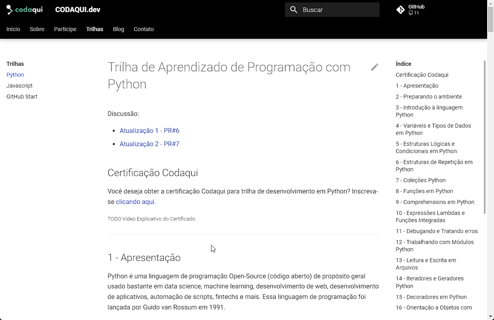

# Hello world!

Queremos levar o ensino tecnológico para onde ainda existem barreiras.

A Codaqui é uma escola de programação sem fins lucrativos que apoia jovens que desejam aprender a desenvolver produtos tecnológicos mas não possuem acesso a uma educação tecnológica por outros meios.

<!-- more -->

# Hacktoberfest da Codaqui

Para iniciar nossos trabalhos, depois de dois anos *tentando* nos organizar, gostaríamos de convidar toda comunidade para participar do Hacktoberfest com a Codaqui.

O Hacktoberfest é um evento anual que encoraja as pessoas a contribuir com projetos open source ao longo do mês de outubro. 

## Como participar

### Como se inscrever no Hacktoberfest?
- Registre-se em qualquer momento entre o dia 26 de setembro e o dia 31 de outubro de 2022, pelo site: [hacktoberfest.com](https://hacktoberfest.com/)
- Tenha 4 pull/merge requests aceitos em repositórios participantes do evento entre 1º de outubro e 31 de outubro de 2022 para completar o Hacktoberfest.
- Os 40.000 primeiros participantes a completar o Hacktoberfest poderão escolher para receber um entre dois prêmios: uma árvore plantada em seu nome, ou uma camiseta do Hacktoberfest 2022.

### Como colaborar criando um novo tópico em uma trilha existente?
- Acesse o site: [codaqui.dev](https://www.codaqui.dev/).
- Clique na aba “Participe”.

- No menu à esquerda, clique em “Quero Apoiar”.

- Clique no link em “acessar aqui” para acessar a página de discussões no GitHub.

- Clique em New Discussion para criar uma discussão.

- Selecione a Categoria "Trilhas de Ensino".

- Preencha o título da sua sugestão, começando com [TRILHA EXISTENTE], seguido pelo nome da trilha para a qual deseja sugerir material. No campo "Write", preencha uma descrição detalhada do que deseja adicionar à trilha, incluindo textos e links sugeridos, seguindo os padrões atuais da trilha. Ao finalizar, clique no botão "Start discussion" para enviar.

- Lembre-se de ler o [Código de Conduta](https://www.codaqui.dev/conduta/) antes de enviar sua sugestão.

### Como colaborar criando um novo exercício em um certificado existente?
- Acesse o site: [codaqui.dev](https://www.codaqui.dev/).
- Clique na aba “Participe”.

- No menu à esquerda, clique em “Quero Apoiar”.

- Clique no link em “acessar aqui” para acessar a página de discussões no GitHub.

- Clique em New Discussion para criar uma discussão.

- Selecione a Categoria "Certificados".

- Preencha o título da sua sugestão, começando com [EXERCÍCIO], seguido pelo nome do certificado no qual deseja adicionar um exercício. No campo "Write", preencha com o enunciado do exercício que deseja adicionar ao certificado e sua resolução. Ao finalizar, clique no botão "Start discussion" para enviar.

- Lembre-se de ler o [Código de Conduta](https://www.codaqui.dev/conduta/) antes de enviar sua sugestão.

### Como criar uma nova trilha?
- Acesse o site: [codaqui.dev](https://www.codaqui.dev/).
- Clique na aba “Participe”.

- No menu à esquerda, clique em “Quero Apoiar”.

- Clique no link em “acessar aqui” para acessar a página de discussões no GitHub.

- Clique em New Discussion para criar uma discussão.

- Selecione a Categoria "Trilhas de Ensino".

- Preencha o título da sua sugestão, começando com [NOVA TRILHA], seguido pelo nome da trilha que deseja sugerir. No campo "Write", escreva mais sobre a trilha que deseja que seja adicionada à Codaqui, incluindo, se quiser, sugestões de materiais e textos. Ao finalizar, clique no botão "Start discussion" para enviar.

- Lembre-se de ler o [Código de Conduta](https://www.codaqui.dev/conduta/) antes de enviar sua sugestão.

### Como criar um novo certificado?
- Acesse o site: [codaqui.dev](https://www.codaqui.dev/).
- Clique na aba “Participe”.

- No menu à esquerda, clique em “Quero Apoiar”.

- Clique no link em “acessar aqui” para acessar a página de discussões no GitHub.

- Clique em New Discussion para criar uma discussão.

- Selecione a Categoria "Certificados".

- Preencha o título da sua sugestão, começando com [NOVO CERTIFICADO], seguido pelo título do certificado que deseja sugerir. No campo "Write", escreva mais sobre o certificado que deseja que seja adicionado à Codaqui, incluindo, se quiser, sugestões de textos e exercícios (com solução) para o certificado. Ao finalizar, clique no botão "Start discussion" para enviar.

- Lembre-se de ler o [Código de Conduta](https://www.codaqui.dev/conduta/) antes de enviar sua sugestão.

### Como auxiliar verificando se os conteúdos das trilhas permanecem online?
- Acesse o site: [codaqui.dev](https://www.codaqui.dev/)
- Clique em “Trilhas” no menu superior:

- Escolha a trilha que gostaria de verificar no menu à esquerda:

- Acesse os links apresentados na trilha e verifique se estão todos funcionando e disponíveis.
Caso identifique algum link com problemas, crie uma discussão informando o problema identificado, [clicando aqui](https://github.com/codaqui/institucional/discussions/categories/trilhas-de-ensino).

## Regras e Conduta

### Regras do Hacktoberfest
- Seus Pull Requests (PR) e Merge Requests (MR) devem ser feitos dentro das datas limite do Hacktoberfest: entre 1º de outubro e 31 de outubro de 2022 (em qualquer fuso horário).
- Seus PR/MRs devem ser feitos em repositórios públicos e não arquivados.
Repositórios que não estejam de acordo com os valores do Hacktoberfest serão excluídos da qualificação e os PR/MRs feitos nestes repositórios não contarão.
- Seus PR/MRs não devem ser SPAM. PR/MRs que forem marcados com uma label contendo a palavra “spam” pelos mantenedores não serão contados.
    - O Hacktoberfest usa o Node.js 16 RegEx engine com /\bspam\b/i para procurar labels de spam.
    - PR/MRs que também tenham o “hacktoberfest-accepted” label não poderão ser marcados como SPAM através de label.
    - PR/MRs que tiverem sido mergiados e não tiverem uma label contendo a palavra “invalid” não poderão ser marcados como SPAM através de label.
- PR/MRs que o sistema do Hacktoberfest detectar como SPAM também não serão contados.
- Qualquer usuário com dois ou mais PR/MRs de SPAM será desqualificado.
- Seus PR/MRs devem ser feitos em um repositório tagueado com o tópico “hacktoberfest”, ou com o label “hacktoberfest-accepted”.
- Suas PR/MRs não podem ser marcadas com o label “invalid”. PRs/MRs que forem marcados com o label “invalid” não serão contadas, a não ser que eles também estejam marcados com o label “hacktoberfest-accepted”.
    - O Hacktoberfest usa o Node.js 16 RegEx engine com /\binvalid\b/i para procurar labels de invalid.
- Suas PR/MRs devem ser mergeadas, ter o label “hacktoberfest-accepted” ou ter uma revisão com aprovação geral.
    - Suas PR/MRs não serão consideradas aceitas se forem apenas um rascunho.
    - Se sua PR/MR estiver sendo aceita para o Hacktoberfest por uma revisão com aprovação geral, ela também não pode estar encerrada.
- Assim que suas PR/MRs passarem por todas as checagens acima, será aceita para o Hacktoberfest após um período de 7 dias para revisão.
    - O Hacktoberfest continuamente avalia todas as checagens. Se o PR/MR falhar em qualquer uma das checagens durante esse período, o prazo de 7 dias será reiniciado.
    - Após os 7 dias para revisão completos, sua PR/MR será automaticamente aceita no Hacktoberfest, assumindo que ainda passe por todas as checagens. Uma vez aceita para o Hacktoberfest, eles pararão de checá-la.

### Regras da Codaqui
- Ao abrir uma Discussão, conforme orientado no “Como participar”, ela será transformada em um Pull Request e passará pela avaliação da Codaqui para que seja mergeado ou não.
- Atente-se a todas as instruções e regras de conduta da Codaqui ao fazer sua contribuição.
- Caso sua contribuição seja válida dentro de todas as regras do Hacktoberfest e da Codaqui, sua pontuação será recebida no prazo de 7 dias úteis a partir da checagem em que ela for considerada válida pela primeira vez, conforme já explicado nas regras do Hacktoberfest.

## Teamplay

- Respeite a primeira pessoa que sinalizou um problema, ela terá prioridade na resolução deste problema, e perderá a mesma se mantiver inativa por mais de 36 horas.
- Seja respeitoso com os demais ao enviar sugestões e participar de discussões. Todos estão participando com o mesmo objetivo de contribuir.

## Repositórios

Os repositórios da Codaqui que poderão receber PR/MRs durante o período do Hacktoberfest são:
- [Institucional](https://github.com/codaqui/institucional)
- [Certificado Python](https://github.com/codaqui/certificado-python)
- [Certificado Javascript](https://github.com/codaqui/certificado-javascript)

*Caso alguma nova trilha ou certificado seja criada por algum outro membro, o mesmo será adicionado aqui no prazo de 24 horas.*

# Fluxo

